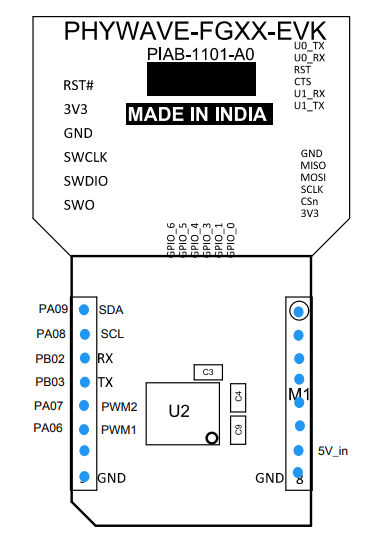

# PIN_REFERENCE - PHY_COAP_CODE Hardware Pin Mapping (CORRECTED)

## Board Overview

**Board Model:** PHYWAVE-FGXX-EVK (PIAB-1101-A0)  
**Microcontroller:** EFR32FG28B322F1024IM48  
**Manufacturer:** Made in India

### Pin Diagram

## Detailed Pin Mapping

### Communication Interfaces

#### I2C Sensor Bus (I2C0 - Primary)
| Signal | Port | Pin | Function | Device | Pull-up |
|--------|------|-----|----------|--------|---------|
| SDA | A | 9 | I2C Data | Si7021, VEML6035 | 4.7kΩ |
| SCL | A | 8 | I2C Clock | Si7021, VEML6035 | 4.7kΩ |
| GND | - | - | Ground | - | - |
| 3.3V | - | - | Power | - | - |

**I2C Configuration:**
- Instance: I2C0 (sensor)
- Bus Speed: 100 kHz (standard mode)
- Pull-up resistors: 4.7kΩ recommended on both SDA and SCL
- SDA: PA09, SCL: PA08

#### UART for Debug Console (EUSART1 - vcom)
| Signal | Port | Pin | Function | Baud Rate | Purpose |
|--------|------|-----|----------|-----------|---------|
| TX | C | 3 | Transmit | 115200 | Debug output |
| RX | C | 4 | Receive | 115200 | Debug input |

**Configuration:**
- EUSART Instance: 1 (vcom)
- Baud Rate: 115200 bps
- Data Bits: 8
- Stop Bits: 1
- Parity: None
- Flow Control: None

#### UART for Modbus RTU (EUSART0 - expansion port)
| Signal | Port | Pin | Function | Purpose |
|--------|------|-----|----------|---------|
| TX | B | 3 | Transmit Data | Modbus communication |
| RX | B | 2 | Receive Data | Modbus communication |

**Configuration:**
- EUSART Instance: 0 (Expansion port)
- Protocol: Modbus RTU
- Baud Rate: 9600 bps (configurable)
- Data Bits: 8
- Stop Bits: 1
- Parity: Even
- Timeout: 1000 ms
- DE/RE Pin (PC02): Controls half-duplex transceiver direction

---

### Sensor Integration Pins

#### Si7021 Temperature & Humidity Sensor
| Connection | EFR32FG28 Pin | Si7021 Pin | Notes |
|------------|----------------|-----------|-------|
| SDA | PA09 | SDA | I2C Data |
| SCL | PA08 | SCL | I2C Clock |
| 3.3V | 3.3V | VCC | Power |
| GND | GND | GND | Ground |
| I2C Address | - | - | 0x40 (Fixed) |

**Features:**
- Temperature Range: -10 to +85°C
- Humidity Range: 0 to 100% RH
- I2C Response Time: <1 ms

#### VEML6035 Ambient Light Sensor
| Connection | EFR32FG28 Pin | VEML6035 Pin | Notes |
|------------|----------------|-------------|-------|
| SDA | PA09 | SDA | I2C Data |
| SCL | PA08 | SCL | I2C Clock |
| 3.3V | 3.3V | VCC | Power |
| GND | GND | GND | Ground |
| I2C Address | - | - | 0x10 (Fixed) |

**Features:**
- Measurement Range: 0 to 64,000 lux
- I2C Response Time: <10 ms
- Auto-ranging capability

#### Energy Meter (Modbus RTU)
| Connection | EFR32FG28 Pin | Meter Pin | Notes |
|------------|----------------|-----------|-------|
| TX | PB03 | RX (Data-) | Modbus transmit (EUSART0) |
| RX | PB02 | TX (Data+) | Modbus receive (EUSART0) |
| GND | GND | GND | Ground |

**Configuration:**
- Modbus Slave ID: 1 (default, configurable)
- Baud Rate: 9600 bps
- Data Bits: 8
- Parity: Even
- Stop Bits: 1
- Response Timeout: 1000 ms

---

### Control & LED Pins

#### Relay Control LED
| Signal | Port | Pin | Function | Purpose |
|--------|------|-----|----------|---------|
| LED_RELAY | A | 6 | Digital Output | Relay control (1=ON, 0=OFF) |
| GND | - | - | Ground | - |

**Characteristics:**
- Output Type: GPIO (Drive strength: 20 mA max)
- For higher currents, use external transistor/relay driver
- Controlled via CoAP endpoints `/ledon` and `/ledoff`

#### Relay Status LED
| Signal | Port | Pin | Function | Purpose |
|--------|------|-----|----------|---------|
| LED_RELAY_STATUS | A | 7 | Digital Output | Relay status indicator |
| GND | - | - | Ground | - |

**Characteristics:**
- Shows relay operational status
- ON when relay is active

#### Network Status LED
| Signal | Port | Pin | Function | Purpose |
|--------|------|-----|----------|---------|
| LED_NETWORK_STATUS | D | 0 | Digital Output | Network connection indicator |
| GND | - | - | Ground | - |

**States:**
- ON: Connected to Wi-SUN network (FFN/LFN active)
- OFF: Not connected or searching
- Blinking: Joining process in progress

---

## Pin Summary Table

### All GPIO Pins Used

| Port | Pin | Signal Name | Direction | Function | Instance | Status |
|------|-----|-------------|-----------|----------|----------|--------|
| A | 6 | LED_RELAY | Output | Relay control | GPIO | Active |
| A | 7 | LED_RELAY_STATUS | Output | Relay status indicator | GPIO | Active |
| A | 8 | I2C_SCL | In/Out | I2C clock (Open-Drain) | I2C0 | Active |
| A | 9 | I2C_SDA | In/Out | I2C data (Open-Drain) | I2C0 | Active |
| B | 2 | UART_RX (Modbus) | Input | Modbus data receive | EUSART0 | Active |
| B | 3 | UART_TX (Modbus) | Output | Modbus data transmit | EUSART0 | Active |
| C | 2 | DE/RE (RS485) | Output | RS485 direction control | GPIO | Active |
| C | 3 | DEBUG_TX | Output | Debug UART transmit | EUSART1 | Active |
| C | 4 | DEBUG_RX | Input | Debug UART receive | EUSART1 | Active |
| D | 0 | LED_NETWORK_STATUS | Output | Network connection indicator | GPIO | Active |

---

## Troubleshooting Guide

### I2C Issues

**Symptom:** Si7021 not responding (Error 0x0010 - SL_STATUS_NOT_READY)

**Solutions:**
- ✓ Check pull-up resistors (4.7kΩ) are present on SDA (PA09) and SCL (PA08)
- ✓ Measure voltage on SDA/SCL lines (should be ~1.6V after pull-ups settle)
- ✓ Check power supply to sensor (3.3V ±10%)
- ✓ Try reinitialization via `/sensors/reinit_si7021` endpoint

**Symptom:** VEML6035 timeout (Error 0x0031 - SL_STATUS_TIMEOUT)

**Solutions:**
- ✓ Verify I2C address (0x10) via I2C scanner tool
- ✓ Check for address conflicts with other devices
- ✓ Increase I2C timeout value
- ✓ Reinitialize sensor via `/sensors/reinit_veml` endpoint

### Modbus Issues

**Symptom:** Energy meter not communicating

**Solutions:**
- ✓ Verify TX/RX wiring (PB03=TX, PB02=RX for EUSART0)
- ✓ Check baud rate: 9600 bps is default
- ✓ Verify RS485 slave ID: Default is 1 (check meter configuration)
- ✓ Confirm DE/RE control on PC02 is working
- ✓ Check termination resistor (120Ω) at far end of bus
- ✓ Test with oscilloscope: Look for 3.3V UART signal on PB03 (TX)

### Debug UART Issues

**Symptom:** No debug output visible

**Solutions:**
- ✓ Check UART cable: TX from board to RX on terminal, RX from board to TX on terminal
- ✓ Verify correct EUSART instance: EUSART1 (vcom)
- ✓ Verify baud rate: 115200 bps
- ✓ Confirm terminal program listening on correct COM port
- ✓ Check USB-UART adapter driver is installed
- ✓ Verify PC03=TX, PC04=RX connections

---

## Related Documentation

- See [readme.md](readme.md) for project overview and CoAP endpoints
- See [HOW_TO_ADD_COAP_ENDPOINTS.md](HOW_TO_ADD_COAP_ENDPOINTS.md) for software development
- See Simplicity Studio Component Configurator for detailed I2C/UART settings
- Refer to EFR32FG28 Datasheet for electrical specifications
