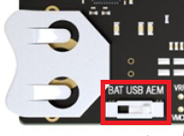

# PHY_COAP_CODE - Wi-SUN IoT Sensor Hub with CoAP Interface

## Project Overview

PHY_COAP_CODE is a comprehensive Wi-SUN mesh networking application running on Silicon Labs EFR32FG28 microcontrollers. This project provides RESTful CoAP endpoints for remote monitoring and control of environmental sensors, energy meters, and relay controls over a Wi-SUN mesh network.

### Key Features

- **Wi-SUN Mesh Networking**: Full-Function Node (FFN) with LFN support
- **CoAP Protocol**: 40+ RESTful endpoints for device management and sensor access
- **Multi-Sensor Integration**:
  - Si7021: Temperature and humidity sensor (I2C)
  - VEML6035: Ambient light sensor (I2C)
  - Modbus RTU: Energy meter (UART/RS485)
- **Relay Control**: Remote switching via CoAP commands
- **Network Diagnostics**: Connection statistics, RPL routing info, neighbor tracking
- **Crash Handler**: Fault detection and reporting system
- **Persistent Storage**: NVM3 for configuration parameters

### Hardware Requirements

- **Board**: EFR32FG28B322F1024IM48 on WSTK
- **Sensors** (optional):
  - Si7021 temperature/humidity sensor (I2C address 0x40)
  - VEML6035 light sensor (I2C address 0x10)
  - Modbus RTU energy meter (UART)
- **I2C Configuration**:
  - Instance: `sensor`
  - SCL: PC05
  - SDA: PC07
  - Pull-up resistors required (4.7kΩ recommended)
- **RS485 Configuration**:
  - DE/RE control: PC02

## Getting Started

### 1. Hardware Setup

1. Mount the EFR32FG28 radio board on the WSTK
2. Ensure power supply switch is in AEM position (right side)
3. Connect sensors to I2C bus (if using):
   - Si7021: SCL→PC05, SDA→PC07, VCC→3.3V, GND→GND
   - VEML6035: SCL→PC05, SDA→PC07, VCC→3.3V, GND→GND
4. Connect Modbus meter to UART (if using):
   - RS485 DE/RE control → PC02

**See [PIN_REFERENCE.md](PIN_REFERENCE.md) for detailed pin mapping, wiring diagrams, and hardware specifications.**

### 2. Software Setup

#### Project Documentation Files

Key documentation available in the project:

- **[readme.md](readme.md)** - This file: Complete project overview and usage guide
- **[PIN_REFERENCE.md](PIN_REFERENCE.md)** - Hardware pin mapping, wiring diagrams, and connector pinouts
- **[HOW_TO_ADD_COAP_ENDPOINTS.md](HOW_TO_ADD_COAP_ENDPOINTS.md)** - Guide for extending the application with new CoAP endpoints

#### Prerequisites
- Simplicity Studio v5
- Wi-SUN SDK 2025.6.2 or later
- GNU ARM Toolchain v12.2.1

#### Build Configuration
- **Toolchain**: GNU ARM v12.2.1
- **Optimization**: Debug (`-Og`)
- **Stack Sizes**:
  - App Task: 10240 bytes (5 * 2048)
  - CoAP Handler: 4096 bytes (1024 words)
- **CoAP Configuration**:
  - Max Resources: 50
  - Socket Buffer: 2048 bytes

#### Building the Project
1. Open Simplicity Studio v5
2. Import the PHY_COAP_CODE project
3. Build: Right-click project → "Build Project"
4. Flash: Right-click .hex file → "Flash to Device"

### 3. Network Configuration

Configure Wi-SUN network settings in `config/sl_wisun_config.h`:
- Network Name: Default "Wi-SUN_BR_Rudraram"
- Network Size: Small (default)
- Device Type: FFN with LFN support
- Preferred PAN ID: 0xFFFF (any)

## CoAP Endpoints

The application exposes 40+ CoAP endpoints organized by category. All endpoints are accessible via CoAP GET/POST requests to port 5683.

### Device Information Endpoints (`/info/*`)

- `/info/all` - Complete device information (JSON)
- `/info/device` - Device tag (last 2 bytes of MAC)
- `/info/chip` - Chip part number (FG28)
- `/info/board` - Board name
- `/info/device_type` - FFN/LFN status
- `/info/version` - Firmware version
- `/info/application` - Application name

**Example Request:**
```bash
coap-client -m get coap://[fd12:3456::eae:5fff:fe6d:1fe1]:5683/info/all
```

### Status Endpoints (`/status/*`)

- `/status/all` - All status information (JSON)
- `/status/running` - Uptime since boot
- `/status/parent` - Parent node tag
- `/status/parent_info` - Parent details with RPL rank
- `/status/my_rank` - This node's RPL rank
- `/status/neighbor` - Neighbor info (requires index in payload)
- `/status/connected` - Current connection duration
- `/status/send` - Trigger status transmission

### Sensor Data Endpoints

#### Combined Data
- `/allData` - All sensors + meter + relay status (JSON)
- `/sensorStatus` - Comprehensive sensor status with network info (JSON)

#### Individual Sensors
- `/si7021` - Temperature (°C) and humidity (%) from Si7021
- `/luxData` - Ambient light (lux) from VEML6035
- `/current` - Current measurement (A) from energy meter

#### Energy Meter
- `/meterParam` - Complete meter data (JSON):
  - Voltage (V)
  - Current (A)
  - Frequency (Hz)
  - Power (W)
  - Energy (kWh)
  - Power Factor

**Example Response:**
```json
{
  "voltage": 230.50,
  "current": 2.45,
  "frequency": 50.00,
  "power": 564.73,
  "energy": 123.45,
  "power_factor": 0.98
}
```

### Control Endpoints

- `/ledon` - Turn relay ON (POST)
- `/ledoff` - Turn relay OFF (POST)

**Example:**
```bash
coap-client -m post coap://[device-ipv6]:5683/ledon
```

### Sensor Maintenance Endpoints

- `/sensors/reinit_si7021` - Reinitialize Si7021 sensor (POST)
- `/sensors/reinit_veml` - Reinitialize VEML6035 sensor (POST)

### Statistics Endpoints (`/statistics/*`)

#### Application Statistics
- `/statistics/app/all` - All app statistics (JSON)
- `/statistics/app/join_state_secs` - Time spent in each join state
- `/statistics/app/connections` - Total connection count
- `/statistics/app/connected_total` - Total connected time
- `/statistics/app/disconnected_total` - Total disconnected time
- `/statistics/app/availability` - Availability percentage

#### Stack Statistics
- `/statistics/stack/phy` - PHY layer statistics
- `/statistics/stack/mac` - MAC layer statistics
- `/statistics/stack/fhss` - FHSS statistics
- `/statistics/stack/wisun` - Wi-SUN stack statistics
- `/statistics/stack/network` - Network layer statistics
- `/statistics/stack/regulation` - Regulation statistics

### Configuration Endpoints (`/settings/*`)

- `/settings/auto_send` - Set auto-send period (seconds)
- `/settings/trace_level` - Control RTT trace verbosity
- `/settings/parameter` - Modify application parameters

### Diagnostics Endpoints (`/reporter/*`)

- `/reporter/crash` - Report previous crash info (if any)
- `/reporter/start` - Start RTT trace filtering
- `/reporter/stop` - Stop RTT trace filtering

## Application Architecture

### Initialization Flow

1. **app_init()** (app_init.c):
   - Initialize crash handler
   - Register all CoAP resources (40+)
   - Create app_task thread

2. **app_task()** (app.c):
   - Initialize Modbus master
   - Initialize Si7021 sensor
   - Initialize VEML6035 sensor
   - Connect to Wi-SUN network
   - Enter main event loop

### Event Handling

The application responds to Wi-SUN events in `sl_wisun_on_event()`:
- **SL_WISUN_EVENT_CONNECTED**: Mark connection time, log status
- **SL_WISUN_EVENT_DISCONNECTED**: Update disconnection statistics
- **SL_WISUN_EVENT_ERROR**: Handle and log errors
- **SL_WISUN_EVENT_JOIN_STATE_CHANGED**: Track join state transitions

### CoAP Resource Handler

CoAP requests are processed by the Wi-SUN CoAP Resource Handler service:
- Resources registered at initialization in `app_coap_resources_init()`
- Each endpoint has a callback function in `app_coap.c`
- Responses are JSON or plain text format
- Maximum response size: 1000 bytes

### Sensor Reading Strategy

Sensors are read **on-demand** when CoAP requests arrive:
- `read_si7021_data()` - Query Si7021 via I2C
- `read_veml_data()` - Query VEML6035 via I2C  
- `read_meter_data()` - Query energy meter via Modbus RTU

Cached readings are timestamped to report data age.

## Troubleshooting

### Sensor Initialization Failures

**Si7021 Error 0x0010 (SL_STATUS_NOT_READY):**
- Check I2C wiring (SCL=PC05, SDA=PC07)
- Verify 3.3V power supply
- Ensure pull-up resistors present
- Confirm I2C address 0x40

**VEML6035 Error 0x0031 (SL_STATUS_TIMEOUT):**
- Check I2C wiring and pull-ups
- Verify I2C address 0x10
- Try sensor reinitialization via `/sensors/reinit_veml`

**Modbus Read Failures:**
- Check RS485 wiring and termination
- Verify DE/RE control on PC02
- Confirm Modbus slave address
- Check baud rate (9600 default)

### Stack Overflow / Crashes

If device crashes when accessing CoAP endpoints:
- Increase `SL_WISUN_COAP_RESOURCE_HND_STACK_SIZE_WORD` in `config/sl_wisun_coap_config.h`
- Increase `APP_STACK_SIZE_BYTES` in `app_init.c`
- Check crash info via `/reporter/crash` endpoint

### Network Connection Issues

**Cannot join network:**
- Verify Border Router is running
- Check network name matches BR configuration
- Ensure RF channel settings match
- Check logs for join state transitions

**Connection drops frequently:**
- Check signal strength (RSL values)
- Verify parent selection
- Review statistics via `/statistics/stack/wisun`

### CoAP Endpoints Return 4.04 Not Found

- Ensure CoAP resources initialized **before** Wi-SUN connection
- Verify `app_coap_resources_init()` called in `app_init()` (not in `app_task()`)
- Check resource count doesn't exceed `SL_WISUN_COAP_RESOURCE_HND_MAX_RESOURCES` (50)

## Key Configuration Parameters

### CoAP Settings (config/sl_wisun_coap_config.h)
```c
#define SL_WISUN_COAP_RESOURCE_HND_MAX_RESOURCES        50U
#define SL_WISUN_COAP_RESOURCE_HND_SOCK_BUFF_SIZE       2048UL
#define SL_WISUN_COAP_RESOURCE_HND_STACK_SIZE_WORD      1024UL
```

### Application Parameters (app_parameters.c)
- `auto_send_sec`: Auto-send period (default: 900s)
- `preferred_pan_id`: Preferred PAN ID (default: 0xFFFF)
- `nb_boots`: Boot counter
- `nb_crashes`: Crash counter

### Stack Sizes (app_init.c)
```c
#define APP_STACK_SIZE_BYTES (5*2048UL)  // 10240 bytes
```

## File Structure

```
PHY_COAP_CODE/
├── app.c/h                      # Main application logic and Wi-SUN event handlers
├── app_init.c                   # Initialization and thread creation
├── app_coap.c/h                 # CoAP endpoint implementations (~2000 lines)
├── app_check_neighbors.c/h      # Neighbor tracking and parent info
├── app_parameters.c/h           # Persistent parameter storage (NVM3)
├── app_timestamp.c/h            # Time tracking and formatting utilities
├── app_rtt_traces.c/h           # RTT trace control and filtering
├── app_reporter.c/h             # Trace reporting functionality
├── app_list_configs.c/h         # Configuration listing utilities
├── sl_wisun_crash_handler.c/h   # Fault detection and crash reporting
├── modbusmaster.c/h             # Modbus RTU communication
├── PIN_REFERENCE.md             # Hardware pin mapping and wiring diagrams
├── HOW_TO_ADD_COAP_ENDPOINTS.md # Guide for adding new CoAP endpoints
├── readme.md                    # Project overview and documentation
├── config/                      # Component configurations
│   ├── sl_wisun_coap_config.h   # CoAP settings
│   └── sl_wisun_config.h        # Wi-SUN network settings
└── autogen/                     # Auto-generated files (do not edit)
```

## Extending the Application

### Adding New CoAP Endpoints

See [HOW_TO_ADD_COAP_ENDPOINTS.md](HOW_TO_ADD_COAP_ENDPOINTS.md) for detailed step-by-step instructions.

Quick overview:
1. Create callback function in `app_coap.c`
2. Register resource in `app_coap_resources_init()`
3. Build response (JSON or text)
4. Return via `app_coap_reply()`

### Adding New Sensors

1. Add hardware driver component via Simplicity Studio
2. Include driver header in `app_coap.c`
3. Initialize sensor in `app_task()` (app.c)
4. Create read function (e.g., `read_new_sensor_data()`)
5. Add CoAP endpoint for sensor access
6. Update data structures for caching

## Performance Characteristics

### Network Performance
- **Join Time**: Typically 45-120 seconds (depends on network size)
- **Connection States**: Select PAN (1s) → Acquire Config (46s) → Configure Routing (72s) → Operational
- **Typical Availability**: >99% in stable network conditions

### Memory Usage
- **Heap Used**: ~23% (dynamic allocation)
- **Flash**: ~450 KB application code
- **RAM**: ~60 KB total (stack + heap + static)

### Power Consumption
- **FFN Active**: ~50-100 mA (transmitting)
- **FFN Idle**: ~30-50 mA (listening)
- **Note**: This is not a low-power application (no sleep modes enabled)

## Testing CoAP Endpoints

### Using libcoap Tools

Install libcoap:
```bash
# Ubuntu/Debian
sudo apt-get install libcoap2-bin

# macOS
brew install libcoap
```

Test endpoints:
```bash
# Get device info
coap-client -m get coap://[fd12:3456::eae:5fff:fe6d:1fe1]:5683/info/all

# Get sensor data
coap-client -m get coap://[device-ipv6]:5683/si7021
coap-client -m get coap://[device-ipv6]:5683/luxData
coap-client -m get coap://[device-ipv6]:5683/meterParam

# Control relay
coap-client -m post coap://[device-ipv6]:5683/ledon
coap-client -m post coap://[device-ipv6]:5683/ledoff

# Get statistics
coap-client -m get coap://[device-ipv6]:5683/statistics/app/all
coap-client -m get coap://[device-ipv6]:5683/status/all
```

### Using Python

```python
import aiocoap
import asyncio

async def get_sensor_data():
    protocol = await aiocoap.Context.create_client_context()
    
    # Get temperature/humidity
    request = aiocoap.Message(code=aiocoap.GET, 
                              uri='coap://[device-ipv6]/si7021')
    response = await protocol.request(request).response
    print(f"Si7021: {response.payload.decode()}")
    
    # Get meter data
    request = aiocoap.Message(code=aiocoap.GET,
                              uri='coap://[device-ipv6]/meterParam')
    response = await protocol.request(request).response
    print(f"Meter: {response.payload.decode()}")

asyncio.run(get_sensor_data())
```

## Development Tips

### Debugging

1. **RTT Console**: Real-time trace output via SEGGER RTT
   - Connect via J-Link RTT Viewer or Simplicity Studio Console
   - Traces show join states, CoAP requests, sensor readings

2. **Trace Levels**: Control verbosity via `/settings/trace_level`
   - Level 0: Errors only
   - Level 1: Warnings
   - Level 2: Info (default when connected)
   - Level 3: Debug
   - Level 4: Verbose

3. **Crash Analysis**: Check `/reporter/crash` after unexpected reboots
   - Shows fault registers (CFSR, HFSR, MMFAR, BFAR)
   - Stack pointer and return address
   - Reset cause from RMU

### Common Mistakes

1. **Calling `app_coap_resources_init()` after network connection**
   - ❌ Resources registered in `app_task()` after `sl_wisun_join()`
   - ✅ Resources registered in `app_init()` before thread creation

2. **Insufficient stack sizes**
   - ❌ Default 2048 bytes causes crashes in complex callbacks
   - ✅ Use 10240 bytes for app task, 4096 bytes for CoAP handler

3. **Missing sensor error handling**
   - ❌ Assuming sensors always initialize successfully
   - ✅ Check return status, provide reinitialization endpoints

4. **Exceeding resource limits**
   - ❌ Registering >50 resources without increasing limit
   - ✅ Configure `SL_WISUN_COAP_RESOURCE_HND_MAX_RESOURCES` accordingly

## Version History

- **V1.0** (Feb 2026): Initial release
  - 40+ CoAP endpoints
  - Si7021, VEML6035, Modbus meter integration
  - Comprehensive network diagnostics
  - Crash handler and persistent parameters

## Troubleshooting

Before programming the radio board mounted on the WSTK, ensure the power supply switch is in the AEM position (right side), as shown.



## Resources

* [Wi-SUN Stack API documentation](https://docs.silabs.com/wisun/latest)
* [AN1330: Wi-SUN Mesh Network Performance](https://www.silabs.com/documents/public/application-notes/an1330-wi-sun-network-performance.pdf)
* [AN1332: Wi-SUN Network Setup and Configuration](https://www.silabs.com/documents/public/application-notes/an1332-wi-sun-network-configuration.pdf)
* [AN1364: Wi-SUN Network Performance Measurement Application](https://www.silabs.com/documents/public/application-notes/an1364-wi-sun-network-performance-measurement-app.pdf)
* [QSG181: Wi-SUN Quick-Start Guide](https://www.silabs.com/documents/public/quick-start-guides/qsg181-wi-sun-sdk-quick-start-guide.pdf)
* [UG495: Wi-SUN Developer's Guide](https://www.silabs.com/documents/public/user-guides/ug495-wi-sun-developers-guide.pdf)

## Report Bugs & Get Support

You are always encouraged and welcome to ask any questions or report any issues you found to us via [Silicon Labs Community](https://community.silabs.com/s/topic/0TO1M000000qHc6WAE/wisun).
