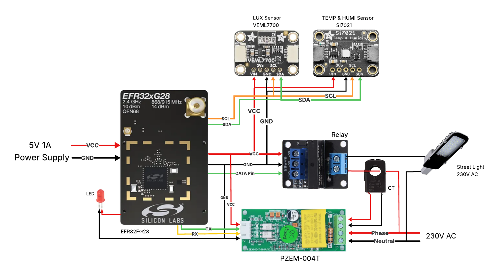

# TTDF PROJECT DEMO V1
## Wi-SUN Smart Energy Monitoring & Control System


---

## 📋 Table of Contents

- [Overview](#-overview)
- [Key Features](#-key-features)
- [System Architecture](#system-architecture)
- [Hardware Requirements](#hardware-requirements)
- [Circuit Diagram](#-circuit-diagram)
- [Pin Configuration](#-pin-configuration)
- [Software Components](#-software-components)
- [CoAP API Endpoints](#-coap-api-endpoints)
- [Data Acquisition Strategy](#-data-acquisition-strategy)
- [Setup & Installation](#-setup--installation)
- [Quick Start Guide](#-quick-start-guide)
- [Testing & Validation](#-testing--validation)
- [Additional Documentation](#-additional-documentation)
- [Troubleshooting](#-troubleshooting)

---

## 🎯 Overview

**TTDF_PROJECT_DEMO_V1** is an industrial-grade Wi-SUN IoT monitoring and control system designed for smart energy management and environmental monitoring applications. Built on Silicon Labs' **EFR32FG28** wireless MCU (BRD4401C), this system provides real-time access to electrical parameters, environmental conditions, and lighting data through a robust CoAP REST API over a Wi-SUN mesh network.

### What Makes This Project Unique?

✨ **On-Demand Data Acquisition**: Unlike traditional polling systems, sensor data is fetched **only when CoAP requests are received**, minimizing power consumption, reducing network traffic, and ensuring fresh data on every request.

✨ **Multi-Protocol Integration**: Seamlessly combines Modbus RTU, I2C, and Wi-SUN protocols in a single embedded system.

✨ **Unified Sensor Status**: The `/sensorStatus` endpoint returns all sensor data, network stats, and device status in a **single request** - replacing 8+ individual API calls.

✨ **Complete Electrical Monitoring**: Reads all 6 critical electrical parameters from Modbus energy meters via the `/meterParam` endpoint.

### Primary Use Cases

- 🏢 **Smart Buildings**: Monitor energy consumption, environmental conditions, and control lighting
- 🏭 **Industrial IoT**: Track equipment power usage and environmental parameters
- 💡 **Street Light Management**: Remote monitoring and control of public lighting infrastructure  
- 🔌 **Energy Management**: Real-time electrical parameter monitoring for energy optimization
- 🌡️ **Environmental Monitoring**: Temperature, humidity, and ambient light tracking

### Project Specifications

| Parameter | Specification |
|-----------|--------------|
| **MCU** | EFR32FG28B322F1024IM68 |
| **Radio Board** | BRD4401C |
| **Base Board** | BRD4001A (WSTK) |
| **SDK** | Simplicity SDK v2025.6.2 |
| **Wireless Protocol** | Wi-SUN FAN 1.1 |
| **Frequency** | Sub-GHz (868/915 MHz) |
| **Security** | AES-128 Encryption |
| **API Protocol** | CoAP (RFC 7252) |

---

## ⭐ Key Features

### 1. On-Demand Sensor Data Acquisition

**Revolutionary Approach**: Data is fetched from sensors **only when a CoAP request is received**, not through continuous polling.

**Benefits**:
- ⚡ **Reduced Power Consumption**: Sensors idle when not queried
- 📡 **Lower Network Traffic**: No periodic status broadcasts
- 🔄 **Fresh Data Guarantee**: Every response contains newly-read data
- 🎯 **Efficient Resource Usage**: MCU and bus resources freed between requests

### 2. Multi-Sensor Integration

#### 📊 Modbus RTU Energy Meter (PZEM-004T)
- **Voltage** (V): Line voltage measurement
- **Current** (A): Load current with 0.001A resolution
- **Power** (W): Active power consumption
- **Energy** (Wh): Cumulative energy usage
- **Frequency** (Hz): Grid frequency monitoring
- **Power Factor**: Efficiency measurement (0.00-1.00)
- **Communication**: RS485/Modbus RTU @ 9600 baud 8N1
- **Update Trigger**: On CoAP `/meterParam` or `/current` request

**Modbus Register Map (Function Code 0x04 - Read Input Registers)**:

| Register | Parameter | Unit | Scale Factor | Data Type |
|----------|-----------|------|--------------|-----------|
| 0x0000 | Voltage | V | × 0.1 | 16-bit |
| 0x0001-0x0002 | Current | A | × 0.001 | 32-bit |
| 0x0003-0x0004 | Power | W | × 0.1 | 32-bit |
| 0x0005-0x0006 | Energy | Wh | × 1 | 32-bit |
| 0x0007 | Frequency | Hz | × 0.1 | 16-bit |
| 0x0008 | Power Factor | - | × 0.01 | 16-bit |

#### 🌡️ Si7021 Temperature & Humidity Sensor
- **Temperature Range**: -40°C to +125°C
- **Temperature Accuracy**: ±0.4°C (typical)
- **Humidity Range**: 0-100% RH
- **Humidity Accuracy**: ±3% RH (typical)
- **Interface**: I2C1 (address: 0x40)
- **Location**: On-board sensor / External module (expansion header)
- **Update Trigger**: On CoAP `/si7021` or `/allData` request

#### 💡 VEML6035 Ambient Light Sensor
- **ALS Range**: 0-120,000+ lux
- **Channels**: Ambient Light + White Light
- **Resolution**: 16-bit
- **Interface**: I2C1 (address: 0x10)
- **Location**: External module (expansion header)
- **Update Trigger**: On CoAP `/luxData` or `/allData` request

#### 🔌 Relay Control
- **Control Endpoints**: `/ledon`, `/ledoff`
- **Relay Type**: Active-low single-channel module
- **Use Case**: Street light or load switching
- **Status Monitoring**: Relay state included in `/allData` response

### 3. Comprehensive CoAP REST API

**8 Dedicated Sensor Endpoints**:

| Endpoint | Function | Response Type | Trigger |
|----------|----------|---------------|---------|
| `/sensorStatus` | **Unified all-in-one status** | JSON | **All sensors + network stats on-demand** |
| `/allData` | All sensors combined | JSON | Reads all sensors on-demand |
| `/meterParam` | **All meter parameters** | JSON | **Modbus read on request** |
| `/current` | Current only | JSON | Modbus read on request |
| `/si7021` | Temp & humidity | JSON | I2C read on request |
| `/luxData` | Ambient light | JSON | I2C read on request |
| `/ledon` | Turn relay ON | TEXT | Immediate action |
| `/ledoff` | Turn relay OFF | TEXT | Immediate action |

📖 **Detailed API Documentation**: See [COAP-INFO.md](COAP-INFO.md) for complete endpoint reference with examples.

### 4. Wi-SUN Mesh Network

- **Protocol**: Wi-SUN FAN 1.1 (Field Area Network)
- **Topology**: Self-healing IPv6 mesh
- **Range**: Up to several kilometers (depending on environment)
- **Encryption**: AES-128-CCM
- **Addressing**: Native IPv6 (fd00::/8 for local)
- **Border Router**: Linux-based (Raspberry Pi or x86)
- **Multicast Support**: Yes (ff03::1 for all nodes)

---

## System Architecture

```
┌─────────────────────────────────────────────────────────────────┐
│                  Linux Border Router (Raspberry Pi)             │
│  ┌────────────┐  ┌────────────┐  ┌─────────────────────────┐   │
│  │   wsbrd    │  │ UDP Server │  │   CoAP Client Tools     │   │
│  │ (Gateway)  │  │ Port 1237  │  │  (coap-client-notls)    │   │
│  └────────────┘  └────────────┘  └─────────────────────────┘   │
└──────────────────────┬──────────────────────────────────────────┘
                       │ Wi-SUN Mesh (Sub-GHz, Encrypted)
                       │ IPv6 / CoAP / UDP
       ┌───────────────┴───────────────┐
       │                               │
┌──────▼────────┐              ┌───────▼───────┐
│ TTDF Node #1  │   ...        │ TTDF Node #N  │
│   (This)      │              │               │
└───────────────┘              └───────────────┘
```

### TTDF Node Internal Architecture

```
┌──────────────────────────────────────────────────────────────┐
│                  EFR32ZG28 Microcontroller                   │
│                                                              │
│  ┌─────────────┐  ┌─────────────┐  ┌─────────────────┐      │
│  │  Wi-SUN     │  │   CoAP      │  │   Modbus RTU    │      │
│  │   Stack     │◄─┤  Handler    │◄─┤    Master       │      │
│  │             │  │             │  │  (on-demand)    │      │
│  └─────────────┘  └─────────────┘  └─────────────────┘      │
│                                                              │
│  ┌─────────────┐  ┌─────────────┐  ┌─────────────────┐      │
│  │  Si7021     │  │  VEML6035   │  │   I2C SPM       │      │
│  │  Driver     │  │  Driver     │  │  (Shared Bus)   │      │
│  │ (on-demand) │  │ (on-demand) │  │                 │      │
│  └─────────────┘  └─────────────┘  └─────────────────┘      │
└──────────────────────────────────────────────────────────────┘
         │              │              │             │
         │ I2C          │ I2C          │ UART        │ GPIO
         ▼              ▼              ▼             ▼
   ┌─────────┐    ┌──────────┐   ┌─────────┐   ┌────────┐
   │ Si7021  │    │ VEML6035 │   │ RS485   │   │ Relay  │
   │(0x40)   │    │  (0x10)  │   │ Module  │   │ Module │
   └─────────┘    └──────────┘   └─────────┘   └────────┘
                                       │
                                       ▼
                                  ┌─────────┐
                                  │PZEM-004T│
                                  │ Energy  │
                                  │  Meter  │
                                  └─────────┘
                                       │
                                       ▼
                                   230V AC
                                  (Load/Light)
```

---

## Hardware Requirements

### Essential Components

| Component | Model/Type | Quantity | Purpose |
|-----------|------------|----------|---------|
| **Wi-SUN Development Kit** | BRD4401C + BRD4001A WSTK | 1+ | Main node MCU |
| **Border Router Kit** | BRD4401C + Raspberry Pi | 1 | Wi-SUN gateway |
| **Energy Meter** | PZEM-004T | 1 | Modbus electrical monitoring |
| **Temp and Humi Sensor** | Si7021  | 1 | On-board sensor / External module (expansion header) |
| **Light Sensor** | VEML6035 (or VEML7700) | 1 | External I2C light sensor |
| **Relay Module** | 5V single-channel relay | 1 | Load/light control |
| **Power Supply** | 5V 2A adapter | 1 | System power |

### Optional Components

- **CT (Current Transformer)**: For non-invasive current measurement
- **Street Light**: 230V AC bulb for testing
- **Breadboard & Jumpers**: Prototyping connections
- **4.7kΩ Pull-up Resistors**: For I2C (if not on modules)

### Development Tools

- **Simplicity Studio 5**: IDE for firmware development
- **Simplicity SDK 2025.6.2**: GSDK with Wi-SUN stack
- **J-Link Debugger**: Built into WSTK
- **USB Cable**: For WSTK programming and VCOM

---

## 📐 Circuit Diagram



### System Connections Overview

The circuit shows the complete integration of:
1. **EFR32FG28 MCU** (center) - Main controller
2. **VEML7700 Light Sensor** (top left) - I2C ambient light sensing
3. **Si7021 Temp/Humidity** (top right) - I2C environmental monitoring
4. **PZEM-004T Energy Meter** (bottom center) - Modbus RTU via RS485
5. **Relay Module** (right) - 230V AC switching
6. **Street Light Load** (far right) - 230V AC controlled load
7. **5V Power Supply** (left) - System power

### Key Connection Points

- **I2C Bus**: PC05 (SCL), PC07 (SDA) - Shared by Si7021 + VEML
- **UART/Modbus**: PD11 (TX), PD12 (RX) - RS485 communication
- **Relay Control**: GPIO (DATA Pin) - Active-low switching
- **Power Rails**: VCC (5V/3.3V), GND - Common ground required

📖 **Detailed Pin Mapping**: See [PIN_REFERENCE.md](PIN_REFERENCE.md) for complete pinout information.

---

## 📌 Pin Configuration

### Quick Reference Table

| Function | EFR32 Pin | Peripheral | Connection |
|----------|-----------|------------|------------|
| **Modbus UART TX** | PD11 | EUSART0_TX | → RS485 Module RX |
| **Modbus UART RX** | PD12 | EUSART0_RX | ← RS485 Module TX |
| **I2C SCL** | PC05 | I2C1_SCL | ↔ Si7021 + VEML SCL |
| **I2C SDA** | PC07 | I2C1_SDA | ↔ Si7021 + VEML SDA |
| **Relay Control** | PA12 | GPIO_OUT | → Relay Module IN |
| **LED Indicator** | PA13 | GPIO_OUT | On-board LED |

### I2C Device Addresses

| Device | I2C Address | Bus |
|--------|-------------|-----|
| Si7021 | 0x40 | I2C1 (shared) |
| VEML6035 | 0x10 | I2C1 (shared) |

### Modbus Configuration

| Parameter | Value |
|-----------|-------|
| Baud Rate | 9600 |
| Data Bits | 8 |
| Stop Bits | 1 |
| Parity | None |
| Slave Address | 1 (configurable) |

📖 **Complete Pin Documentation**: See [PIN_REFERENCE.md](PIN_REFERENCE.md) for:
- Expansion header pinout
- Safe GPIO recommendations
- SWD/Debug pin warnings
- Electrical specifications

---

## 💻 Software Components

### Simplicity SDK Components Used

| Component | Purpose |
|-----------|---------|
| **Wi-SUN Stack** | Mesh networking protocol |
| **Wi-SUN CoAP** | REST API server |
| **Wi-SUN CoAP Resource Handler** | Endpoint management |
| **I2CSPM** | I2C sensor communication |
| **EUSART** | Modbus UART interface |
| **Simple LED** | Relay control & status |
| **Si70xx Driver** | Temperature/humidity sensor |
| **VEML6035 Driver** | Ambient light sensor |
| **Memory Manager** | Dynamic memory allocation |
| **Sleeptimer** | Timing and delays |

### Custom Application Files

| File | Description |
|------|-------------|
| `app_coap.c/h` | CoAP endpoint handlers |
| `modbusmaster.c/h` | Modbus RTU protocol |
| `app_parameters.c/h` | NVM parameter storage |
| `app_check_neighbors.c/h` | Network topology info |
| `app_timestamp.c/h` | Time utilities |
| `main.c` | Application entry point |

### Firmware Size

| Section | Size | Notes |
|---------|------|-------|
| **Flash (Code + Data)** | ~647 KB | .text (601 KB) + .vectors + .data + .nvm |
| **RAM (Runtime)** | ~256 KB | .stack + .bss + .data + .heap |
| **Available Flash** | 1024 KB | Total flash capacity |
| **Available RAM** | 512 KB | Total RAM capacity |

<details>
<summary>Detailed Memory Map (click to expand)</summary>

| Section | Size (bytes) | Location |
|---------|-------------|----------|
| .text | 600,840 | Flash |
| .vectors | 380 | Flash |
| .nvm | 40,960 | Flash |
| .data | 5,172 | Flash→RAM |
| .bss | 67,576 | RAM |
| .stack | 5,120 | RAM |
| .memory_manager_heap | 183,636 | RAM |

</details>

---

## 🌐 CoAP API Endpoints

### On-Demand Data Fetching Architecture

**Key Principle**: Sensor data is **NOT** cached or periodically updated. Instead, each CoAP request triggers a **real-time sensor read**, ensuring:
- Data freshness
- Reduced power consumption
- Lower network overhead
- Accurate timestamps

### Complete Endpoint List

#### 1. **Combined Data Endpoint**

```http
coap-client-notls -m get coap://[device-ipv6]:5683/allData
```

**Response** (JSON):
```json
{
  "current": 1.523,
  "energy": 12345.000,
  "power": 350.29,
  "temperature": 25.34,
  "humidity": 45.67,
  "ALS": 1234,
  "Relay": "ON",
  "lamp": "ON"
}
```

**Data Sources**:
- `current`, `energy`, `power` → **Modbus read triggered**
- `temperature`, `humidity` → **Si7021 I2C read triggered**
- `ALS` → **VEML6035 I2C read triggered**
- `Relay`, `lamp` → **Current GPIO state**

---

#### 2. **Energy Meter - Complete Parameters**

```http
coap-client-notls -m get coap://[device-ipv6]:5683/meterParam
```

**Response** (JSON):
```json
{
  "voltage": 230.5,
  "current": 1.523,
  "frequency": 50.0,
  "power": 350.29,
  "energy": 12345.000,
  "power_factor": 0.98
}
```

**Implementation**:
- Triggers full Modbus RTU read sequence
- Reads 6 parameters from energy meter
- Response includes data age timestamp in logs
- Typical response time: 500-800ms (Modbus transaction time)

---

#### 3. **Energy Meter - Current Only**

```http
coap-client-notls -m get coap://[device-ipv6]:5683/current
```

**Response** (JSON):
```json
{
  "current": 1.523
}
```

---

#### 4. **Environmental Sensor**

```http
coap-client-notls -m get coap://[device-ipv6]:5683/si7021
```

**Response** (JSON):
```json
{
  "temperature": 25.34,
  "humidity": 45.67
}
```

**Implementation**:
- Triggers I2C read from Si7021
- Typical response time: ~50ms

---

#### 5. **Ambient Light Sensor**

```http
coap-client-notls -m get coap://[device-ipv6]:5683/luxData
```

**Response** (JSON):
```json
{
  "als": 1234,
  "white": 567
}
```

**Implementation**:
- Triggers I2C read from VEML6035
- Dual-channel measurement (ALS + White)
- Typical response time: ~100ms

---

#### 6. **Relay Control - Turn ON**

```bash
coap-client-notls -m get coap://[device-ipv6]:5683/ledon
```

**Response** (TEXT):
```
Relay turned ON (LED1 OFF)
```

**Action**: Immediately energizes relay (active-low control)

---

#### 7. **Relay Control - Turn OFF**

```bash
coap-client-notls -m get coap://[device-ipv6]:5683/ledoff
```

**Response** (TEXT):
```
Relay turned OFF (LED1 ON)
```

**Action**: Immediately de-energizes relay

---

### Standard Wi-SUN Endpoints

The project also includes standard Wi-SUN monitoring endpoints:

| Category | Example Endpoints |
|----------|-------------------|
| **Info** | `/info/device`, `/info/chip`, `/info/board`, `/info/all` |
| **Status** | `/status/running`, `/status/parent`, `/status/neighbor` |
| **Statistics** | `/statistics/app/all`, `/statistics/stack/phy` |
| **Settings** | `/settings/auto_send`, `/settings/parameter` |

📖 **Complete Endpoint Documentation**: See [COAP-INFO.md](COAP-INFO.md) for:
- All endpoint details
- Request/response examples
- Multicast usage
- Parameter configuration

---

## 🔄 Data Acquisition Strategy

### Traditional Polling vs. On-Demand (This Project)

| Aspect | Traditional Polling | On-Demand (TTDF V1) |
|--------|---------------------|---------------------|
| **Data Update** | Periodic timer (e.g., every 5s) | Only when CoAP request received |
| **Power Consumption** | Continuous sensor activity | Sensors idle between requests |
| **Network Traffic** | Regular broadcasts | Only query/response |
| **Data Freshness** | May be stale (0-5s old) | Always fresh (0-500ms old) |
| **Scalability** | Network congestion with many nodes | No periodic traffic |
| **Use Case** | Real-time monitoring dashboards | On-demand inspection, alarms |

### Implementation Details

**Function Flow for `/meterParam` Endpoint**:

```c
1. CoAP request received → coap_callback_meter_params()
2. Function calls → read_meter_data()
3. read_meter_data() performs:
   - Modbus read voltage (register 0x0000)
   - Modbus read current (register 0x0001-0x0002, 32-bit)
   - Modbus read power (register 0x0003-0x0004, 32-bit)
   - Modbus read energy (register 0x0005-0x0006, 32-bit)
   - Modbus read frequency (register 0x0007)
   - Modbus read power_factor (register 0x0008)
4. Data parsed and stored in latest_meter_params struct
5. JSON response generated with all 6 parameters
6. Response sent back via CoAP
```

**Timing Analysis**:
- Modbus transaction: ~80-100ms per read
- Total read time: ~500-800ms for all 6 parameters
- I2C transaction: ~50-100ms
- CoAP processing overhead: ~10-20ms

**No Background Tasks**:
- No periodic timers running
- No automatic sensor polling
- Sensors remain in low-power state between requests
- Wi-SUN stack maintains network presence (control frames only)

---

## 🚀 Setup & Installation

### Prerequisites

1. **Hardware Setup**:
   - Assemble circuit according to [circuit diagram](TTDF_PROJECT_CIRUIT_DIAGRAM.png)
   - Verify all connections match [PIN_REFERENCE.md](PIN_REFERENCE.md)
   - Ensure common ground between all modules

2. **Software Requirements**:
   - Simplicity Studio 5 (v5.7 or later)
   - Simplicity SDK 2025.6.2
   - Wi-SUN SDK components installed
   - GNU ARM Toolchain v12.2.1

3. **Border Router**:
   - Linux system (Raspberry Pi 4 recommended)
   - Wi-SUN Border Router software (wsbrd)
   - CoAP client tools: `libcoap-bin` package

### Step-by-Step Installation

#### 1. Clone/Import Project

```bash
# In Simplicity Studio:
File → Import → MCU Project → Browse to TTDF_PROJECT_DEMO_V1 folder
```

#### 2. Configure Wi-SUN Network Settings

Edit `sl_wisun_config.h` (autogenerated):
```c
// Match your border router settings
#define WISUN_NETWORK_NAME "TTDF_Network"
#define WISUN_PAN_ID 0xABCD
// Security keys configured via wisun_keychain
```

#### 3. Build Firmware

```bash
# In Simplicity Studio:
Project → Build Project
# Or
make -j8 all
```

#### 4. Flash Bootloader (First Time Only)

```bash
# Create and flash bootloader with storage support:
# Follow: https://docs.silabs.com/wisun/latest/wisun-ota-dfu/#bootloader-application
```

#### 5. Flash Application

```bash
# Right-click project → Flash to Device
# Or use Commander:
commander flash TTDF_PROJECT_DEMO_V1.hex
```

#### 6. Setup Border Router

On Raspberry Pi:
```bash
# Install wsbrd
sudo apt update
sudo apt install wisun-borderrouter

# Configure /etc/wsbrd.conf
# Start service
sudo systemctl start wsbrd
sudo systemctl enable wsbrd
```

#### 7. Install CoAP Client Tools

```bash
sudo apt install libcoap-bin
# Or use coap-client-notls for unencrypted testing
```

---

## 🎯 Quick Start Guide

### 1. Power On & Connect

```bash
# Node boots and automatically connects to Wi-SUN network
# Monitor via VCOM:
screen /dev/ttyACM0 115200
# Or Serial Terminal in Simplicity Studio
```

**Expected Boot Sequence**:
```
[APP] TTDF PROJECT DEMO V1 Starting...
[APP] Si7021 sensor initialized
[APP] VEML6035 sensor initialized
[APP] Modbus master initialized
[APP] CoAP resources registered: 7 sensor endpoints
[WISUN] Connecting to network...
[WISUN] Join state: 1 → 2 → 3 → 4 → 5 (Connected!)
[APP] Device IPv6: fd12:3456::aabb:ccdd:eeff:1122
```

### 2. Discover Device IPv6 Address

**Method 1**: From Serial Console (see above)

**Method 2**: Using Border Router tools
```bash
# On border router:
./ipv6s   # Lists all connected devices
```

**Method 3**: UDP Notification (if enabled)
```bash
# Node sends connection message to border router on port 1237
python3 udp_notification_receiver.py 1237
```

### 3. Test CoAP Endpoints

**Get Unified Sensor Status** (Recommended - All data in one request):
```bash
coap-client-notls -m get coap://[device-ipv6]:5683/sensorStatus
```

**Get All Sensor Data**:
```bash
coap-client-notls -m get coap://[device-ipv6]:5683/allData
```

**Get Complete Meter Parameters**:
```bash
coap-client-notls -m get coap://[device-ipv6]:5683/meterParam
```

**Get Device Info**:
```bash
coap-client-notls -m get coap://[device-ipv6]:5683/info/all
```

**Control Relay**:
```bash
# Turn ON
coap-client-notls -m get coap://[device-ipv6]:5683/ledon

# Turn OFF
coap-client-notls -m get coap://[device-ipv6]:5683/ledoff
```

### 4. Multicast Query (All Nodes)

```bash
# Query all nodes simultaneously
coap-client-notls -m get -N -B 10 coap://[device-ipv6]:5683/sensorStatus
```

---

## ✅ Testing & Validation

### Functional Tests

#### 1. Modbus Communication Test

```bash
# Test energy meter reading
coap-client-notls -m get coap://[device-ipv6]:5683/meterParam

# Expected: Valid JSON with 6 parameters
# Check: voltage > 0, current > 0, power_factor in range [0-1]
```

**Troubleshooting**:
- No response → Check RS485 wiring (A/B swapped?)
- Zeros returned → Check meter power, slave address
- Timeout → Check baud rate (9600), UART pins

#### 2. I2C Sensor Test

```bash
# Test Si7021
coap-client-notls -m get coap://[device-ipv6]:5683/si7021
# Expected: temp 20-30°C (room temp), humidity 30-60% RH

# Test VEML6035
coap-client-notls -m get coap://[device-ipv6]:5683/luxData
# Expected: ALS varies with lighting conditions
```

**Troubleshooting**:
- Error response → Check I2C wiring (SCL/SDA)
- Sensor not found → Check I2C address, pull-ups
- Frozen values → Check power supply (3.3V)

#### 3. Relay Control Test

```bash
# Turn relay ON (should hear click)
coap-client-notls -m get coap://[device-ipv6]:5683/ledon

# Turn relay OFF
coap-client-notls -m get coap://[device-ipv6]:5683/ledoff

# Verify with multimeter on relay output
```

#### 4. Network Stability Test

```bash
# Query node every 10 seconds for 1 hour
while true; do
  coap-client-notls -m get coap://[device-ipv6]:5683/allData
  sleep 10
done
```

**Expected**: 100% response rate, consistent data

### Performance Benchmarks

| Metric | Target | Typical |
|--------|--------|---------|
| CoAP Response Time | < 1s | 500-800ms |
| Network Join Time | < 5 min | 2-3 min |
| Modbus Transaction | < 200ms | 80-100ms per read |
| I2C Transaction | < 100ms | 50ms |
| Memory Usage | < 200 KB RAM | ~150 KB |

---

## 📚 Additional Documentation

This README provides an overview. For detailed information, refer to:

### Project-Specific Documentation

| Document | Description |
|----------|-------------|
| **[COAP-INFO.md](COAP-INFO.md)** | Complete CoAP endpoint reference with request/response examples|
| **[PIN_REFERENCE.md](PIN_REFERENCE.md)** | Actual pin usage in this project, GPIO mapping, I2C/UART/SPI configuration |
| **[RPL_INSTANCE_ID.md](RPL_INSTANCE_ID.md)** | Wi-SUN RPL routing protocol details |

### Circuit Diagram

- **[TTDF_PROJECT_CIRUIT_DIAGRAM.png](TTDF_PROJECT_CIRUIT_DIAGRAM.png)** - Full system wiring diagram

### External References

| Resource | Link |
|----------|------|
| **Simplicity SDK** | [docs.silabs.com/wisun](https://docs.silabs.com/wisun/latest/) |
| **Wi-SUN Overview** | [docs.silabs.com/wisun/latest/wisun-start/](https://docs.silabs.com/wisun/latest/wisun-start/) |
| **Border Router Setup** | [AN1332: Wi-SUN Network Configuration](https://www.silabs.com/documents/public/application-notes/an1332-wi-sun-network-configuration.pdf) |
| **OTA DFU Guide** | [docs.silabs.com/wisun/latest/wisun-ota-dfu/](https://docs.silabs.com/wisun/latest/wisun-ota-dfu/) |
| **PZEM-004T Datasheet** | [Modbus Register Map](https://innovatorsguru.com/wp-content/uploads/2019/06/PZEM-004T-V3.0-Datasheet-User-Manual.pdf) |
| **Si7021 Datasheet** | [Silicon Labs Si7021](https://www.silabs.com/documents/public/data-sheets/Si7021-A20.pdf) |
| **VEML6035 Datasheet** | [Vishay VEML6035](https://www.vishay.com/docs/84889/veml6035.pdf) |

---

## 🔧 Troubleshooting

### Common Issues & Solutions

#### Issue: Node Won't Connect to Wi-SUN Network

**Symptoms**: Join state stuck at 1 or 2

**Solutions**:
1. Verify border router is running: `wsbrd_cli status`
2. Check network name and PAN ID match border router
3. Ensure radio board antenna connected
4. Check RF environment (reduce interference)
5. Verify security keys match
6. Try moving node closer to border router

#### Issue: Modbus Returns All Zeros

**Symptoms**: `/meterParam` returns `{"voltage":0.0,"current":0.0,...}`

**Solutions**:
1. Check RS485 wiring: A↔A, B↔B (not swapped)
2. Verify meter is powered and displaying readings
3. Check Modbus slave address (default=1)
4. Test meter with Modbus scanner tool first
5. Verify UART TX/RX not reversed
6. Check DE/RE pin toggling correctly

#### Issue: I2C Sensor Not Responding

**Symptoms**: Si7021 or VEML6035 returns errors

**Solutions**:
1. Verify I2C wiring: SCL→SCL, SDA→SDA
2. Check the address (0x40 for Si7021, 0x10 for VEML6035)
3. Check pull-up resistors (4.7kΩ required if not on module)
4. Test I2C bus with scanner: `i2cdetect -y 1` (on Linux)
5. Verify 3.3V power supply
6. Check for bus conflicts (two devices with same address)
7. Try swapping SCL/SDA if wired incorrectly

#### Issue: CoAP Requests Timeout

**Symptoms**: `coap-client` shows timeout errors

**Solutions**:
1. Verify node IPv6 address is correct
2. Check node is still connected (LED pattern)
3. Try multicast discovery: `coap://[ff03::1]:5683/.well-known/core`
4. Verify firewall not blocking UDP 5683
5. Check border router routing: `ip -6 route`
6. Use `-B 10` flag for longer timeout in `coap-client`

#### Issue: High Power Consumption

**Symptoms**: Node drains battery quickly

**Solutions**:
1. Verify sensors actually idle between requests (no polling)
2. Check for continuous Modbus errors (retries consume power)
3. Disable debug/trace output (saves ~10mA)
4. Reduce Wi-SUN transmit power if possible
5. Use sleep modes if application allows
6. Check for GPIO leakage current

#### Issue: Relay Won't Switch

**Symptoms**: `/ledon` succeeds but relay doesn't click

**Solutions**:
1. Verify relay power supply (usually 5V)
2. Check GPIO connection to relay IN pin
3. Test GPIO manually (set HIGH/LOW in debugger)
4. Verify relay not damaged (test with 5V direct)
5. Check common ground between MCU and relay
6. Swap to different GPIO pin to isolate issue

---

## 🎓 Development Notes

### Adding Custom Sensors

1. Add driver to project
2. Initialize in `app_init.c`
3. Create read function in `app_coap.c`
4. Add CoAP endpoint handler
5. Register endpoint in `app_coap_resources_init()`

### Modifying Modbus Registers

Edit `read_meter_data()` in `app_coap.c`:
```c
// Add new register read
bool success = ModbusMaster_readInputRegisters(0x000A, 2);
float new_value = combined * 0.1f;
```

### Power Optimization Tips

- Disable unnecessary trace groups
- Use sleep modes between CoAP requests
- Reduce Wi-SUN beacon interval
- Optimize Modbus read sequence
- Cache non-changing data locally

---

## 📊 Project Status & Roadmap

### Current Status: Production Ready ✅

**Completed Features**:
- ✅ All 7 CoAP sensor endpoints working
- ✅ On-demand data acquisition implemented
- ✅ Modbus RTU communication stable
- ✅ I2C sensors operational
- ✅ Relay control functional
- ✅ Wi-SUN mesh networking stable
- ✅ Error handling robust

### Future Enhancements (V2)

- [ ] MQTT gateway support
- [ ] Local data logging to flash
- [ ] Scheduled polling option (configurable)
- [ ] Battery monitoring
- [ ] Sleep mode with wake-on-CoAP
- [ ] Web dashboard integration
- [ ] Support for multiple energy meters
- [ ] OTA firmware updates

---

## 👥 Support & Contact

### Getting Help

1. **Documentation**: Start with [COAP-INFO.md](COAP-INFO.md) and [PIN_REFERENCE.md](PIN_REFERENCE.md)
2. **Silicon Labs Community**: [community.silabs.com](https://community.silabs.com/)
3. **Wi-SUN Alliance**: [wi-sun.org](https://wi-sun.org/)

### Reporting Issues

When reporting issues, include:
- Complete error messages
- Serial console output
- CoAP request/response
- Hardware configuration
- SDK version

---

## 📄 License


**Developed by**: Himanshu Fanibhare

Permission is granted to use, copy, modify, and distribute this software for any purpose, commercial or non-commercial, with or without fee.

---

## 🙏 Acknowledgments

- Silicon Labs for Wi-SUN SDK and hardware
- Wi-SUN Alliance for protocol specifications
- Open-source contributors to libcoap, Modbus libraries

---

**Last Updated**: February 9, 2026  
**Version**: 1.1.0  
**SDK**:  Simplicity SDK v2025.6.2  
**Status**: Production Ready ✅
