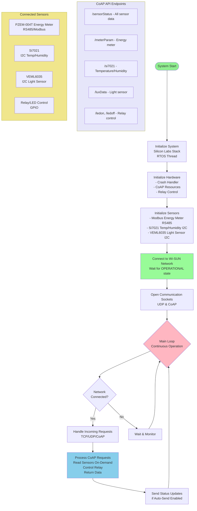
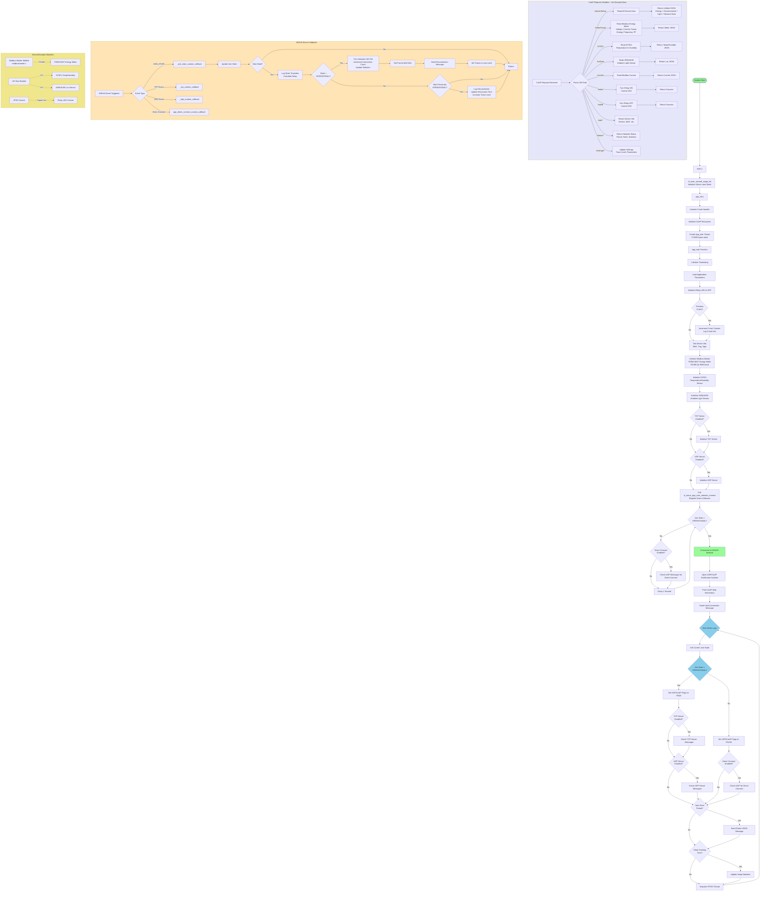

# TTDF WiSUN IoT System - Complete Flowchart

## Project Overview
**TTDF_PROJECT_DEMO_V1** - Wi-SUN Smart Energy Monitoring & Control System

This flowchart represents the complete system architecture and operational flow of the Wi-SUN IoT monitoring and control application built on Silicon Labs EFR32FG28 wireless MCU.

---

## Project Structure

```
TTDF_PROJECT_DEMO_V1.1/
│
├── main.c                              # Entry point - system initialization
├── app.c                               # Main application logic and state machine
├── app.h                               # Application header file
├── app_init.c                          # Application initialization (RTOS thread)
│
├── app_coap.c                          # CoAP request handlers
├── app_coap.h                          # CoAP function prototypes
│
├── modbusmaster.c                      # Modbus RTU master for energy meter
├── modbusmaster.h                      # Modbus function prototypes
│
├── app_tcp_server.c                    # TCP server implementation
├── app_tcp_server.h                    # TCP server header
├── app_udp_server.c                    # UDP server implementation
├── app_udp_server.h                    # UDP server header
├── app_direct_connect.c                # Direct Connect peer-to-peer
├── app_direct_connect.h                # Direct Connect header
├── app_check_neighbors.c               # Neighbor discovery & monitoring
├── app_check_neighbors.h               # Neighbor monitoring header
│
├── app_parameters.c                    # Persistent settings (NVM3)
├── app_parameters.h                    # Parameters header
├── app_timestamp.c                     # Time tracking utilities
├── app_timestamp.h                     # Timestamp header
├── app_reporter.c                      # RTT trace event reporter
├── app_reporter.h                      # Reporter header
├── app_rtt_traces.c                    # Debug trace filtering
├── app_rtt_traces.h                    # RTT traces header
├── sl_wisun_crash_handler.c            # Crash detection & logging
├── sl_wisun_crash_handler.h            # Crash handler header
├── app_list_configs.c                  # RF configuration listing
├── app_list_configs.h                  # Config list header
│
├── app_wisun_multicast_ota.c           # Multicast OTA DFU handler
├── app_wisun_multicast_ota.h           # OTA header
│
├── sl_wisun_regdb.c                    # Regional frequency database
│
├── config/                             # Configuration files folder
│   ├── app_project_info_config.h       # Project metadata
│   ├── app_properties_config.h         # App version (for OTA)
│   ├── pin_config.h                    # GPIO pin assignments
│   ├── sl_i2cspm_sensor_config.h       # I2C bus configuration
│   ├── psa_crypto_config.h             # Security configuration
│   ├── os_cfg.h                        # OS configuration
│   ├── rtos_cfg.h                      # RTOS settings
│   └── ...
│
├── autogen/                            # Auto-generated files
│   ├── sl_wisun_config.c               # Wi-SUN stack config
│   ├── sl_wisun_config.h               # Wi-SUN config header
│   ├── sl_board_default_init.c         # Board initialization
│   ├── rail_config.c                   # Radio configuration
│   ├── rail_config.h                   # Radio config header
│   ├── sl_event_handler.c              # Event dispatcher
│   ├── sl_event_handler.h              # Event handler header
│   ├── sl_iostream_init_eusart_instances.c  # UART initialization
│   ├── sl_iostream_init_eusart_instances.h  # UART init header
│   ├── sl_simple_led_instances.c       # LED control
│   ├── sl_simple_led_instances.h       # LED header
│   └── ...
│
├── README.md                           # Complete project guide
├── SYSTEM_FLOWCHART.md                 # This file - flow diagrams
├── COAP-INFO.md                        # CoAP API reference
├── PIN_REFERENCE.md                    # Pin configuration table
├── RPL_INSTANCE_ID.md                  # Routing instance info
├── OTA_DFU_SETUP.md                    # OTA update guide
├── TTDF_PROJECT_CIRUIT_DIAGRAM.png     # Hardware circuit diagram
│
├── simplicity_sdk_2025.6.2/            # Silicon Labs SDK
├── GNU ARM v12.2.1 - Debug/            # Build output directory
│
├── TTDF_PROJECT_DEMO_V1.slcp           # Simplicity Studio project file
├── TTDF_PROJECT_DEMO_V1.1.pintool      # Pin configuration tool
├── .cproject                           # Eclipse CDT project
├── .project                            # Eclipse project
└── .slps                               # Simplicity Studio project state
```

### Key Files Explained:

| File | Purpose |
|------|---------|
| **main.c** | Entry point, calls `app_init()` and `app_process_action()` |
| **app.c** | Main application loop, Wi-SUN event handling, join state management |
| **app_init.c** | Creates RTOS task for application |
| **app_coap.c** | All CoAP endpoints - sensor data acquisition & relay control |
| **modbusmaster.c** | Modbus RTU master for energy meter communication |
| **app_parameters.c** | Persistent parameters stored in NVM3 |
| **sl_wisun_crash_handler.c** | Detects and logs system crashes |

---

## Simplified System Flow



---

## Detailed System Flow

<details>
<summary>Click to expand detailed flowchart</summary>



</details>

---

## Key System Components

### 1. Initialization Phase
- **Silicon Labs Stack**: Core Wi-SUN protocol stack initialization
- **Crash Handler**: Monitors and logs system crashes
- **CoAP Resources**: REST API endpoint initialization
- **RTOS Thread**: Creates main application task with 10KB stack

### 2. Hardware Initialization
- **Modbus Master**: RS485 communication with PZEM-004T energy meter
- **Si7021 Sensor**: I2C temperature and humidity sensor
- **VEML6035 Sensor**: I2C ambient light sensor
- **Relay Control**: GPIO-based relay/LED control

### 3. Network Connection
- **Wi-SUN Network**: Connects to mesh network
- **Join States**: Monitors connection progress (0-5)
- **Socket Management**: Opens UDP/CoAP notification channels

### 4. Main Operational Loop
- **Join State Monitoring**: Continuously checks network connection status
- **Server Message Handling**: Processes TCP/UDP incoming requests
- **Periodic Tasks**: Auto-send status updates, heap tracking
- **RTOS Dispatch**: Thread scheduling and task management

### 5. CoAP API Endpoints (On-Demand Data Acquisition)

#### Sensor Data Endpoints:
- `/sensorStatus` - Unified sensor status (all data in one request)
- `/meterParam` - Complete energy meter parameters
- `/si7021` - Temperature and humidity
- `/luxData` - Ambient light level
- `/current` - Real-time current measurement

#### Control Endpoints:
- `/ledon` - Turn relay ON
- `/ledoff` - Turn relay OFF

#### Information Endpoints:
- `/info/*` - Device information (MAC, version, chip, etc.)
- `/status/*` - Network status (parent, rank, statistics)
- `/settings/*` - Configuration management

### 6. Event-Driven Callbacks
- **Join State Events**: Connection/disconnection handling
- **TCP/UDP Events**: Server communication events
- **Direct Connect Events**: Peer-to-peer communication

### 7. Hardware Interfaces
- **RS485/Modbus RTU**: Energy meter communication
- **I2C Bus**: Sensor communication (Si7021, VEML6035)
- **GPIO**: Relay/LED control

---

## Unique Features

### On-Demand Data Acquisition Strategy
Unlike traditional polling systems, this implementation reads sensor data **only when CoAP requests are received**:

**Benefits**:
- ⚡ **Reduced Power Consumption**: Sensors idle when not queried
- 📡 **Lower Network Traffic**: No periodic status broadcasts
- 🔄 **Fresh Data Guarantee**: Every response contains newly-read data
- 🎯 **Efficient Resource Usage**: MCU and bus resources freed between requests

### Dual Join State Checks

1. **Initial Connection Wait** (Startup):
   - Blocking loop waiting for first connection
   - System cannot proceed until network is operational
   
2. **Runtime Connection Monitoring** (Main Loop):
   - Continuous monitoring for disconnections/reconnections
   - Adaptive behavior based on connection status

---

## Technical Specifications

| Component | Details |
|-----------|---------|
| **MCU** | EFR32FG28B322F1024IM68 |
| **Radio Board** | BRD4401C |
| **SDK** | Simplicity SDK v2025.6.2 |
| **Wireless Protocol** | Wi-SUN FAN 1.1 |
| **Frequency** | Sub-GHz (868/915 MHz) |
| **API Protocol** | CoAP (RFC 7252) |
| **RTOS** | Micrium OS |
| **Main Task Stack** | 10,240 bytes (5×2048) |

---

## Usage Instructions

### Viewing the Diagram

#### Option 1: GitHub (Recommended)
1. Push this file to GitHub repository
2. GitHub will automatically render the Mermaid diagram

#### Option 2: VS Code
1. Install **Markdown Preview Mermaid Support** extension
2. Open this file in VS Code
3. Press `Ctrl+Shift+V` to preview

#### Option 3: Online Mermaid Editor
1. Visit [Mermaid Live Editor](https://mermaid.live/)
2. Copy the Mermaid code
3. Paste and edit
4. Export as SVG/PNG/PDF

#### Option 4: Documentation Tools
- **GitLab**: Native Mermaid support
- **Confluence**: Use Mermaid macro
- **Notion**: Use Mermaid code blocks
- **Obsidian**: Native Mermaid support

### Exporting for Reports
1. Open in Mermaid Live Editor
2. Export as **SVG** (vector graphics, scalable)
3. Import into:
   - Microsoft Word
   - LaTeX documents
   - PowerPoint presentations
   - PDF reports

---

## File Information

**Created**: March 2, 2026  
**Project**: TTDF_PROJECT_DEMO_V1.1  
**Technology**: Wi-SUN Mesh Networking, IoT, Embedded Systems  
**License**: Zlib (Silicon Labs)

---

## Related Documentation

- [README.md](README.md) - Complete project documentation
- [COAP-INFO.md](COAP-INFO.md) - CoAP API reference
- [OTA_DFU_SETUP.md](OTA_DFU_SETUP.md) - Over-the-air firmware update guide
- [PIN_REFERENCE.md](PIN_REFERENCE.md) - Hardware pin configuration
- [RPL_INSTANCE_ID.md](RPL_INSTANCE_ID.md) - Routing protocol configuration

---

## Notes

- This flowchart represents the complete system flow from initialization to runtime operation
- Color coding indicates different operational phases and component types
- Subgraphs group related functionality (CoAP handlers, event callbacks, sensor modules)
- The diagram can be split into smaller diagrams for specific documentation needs

---

**For questions or modifications, contact the development team.**
